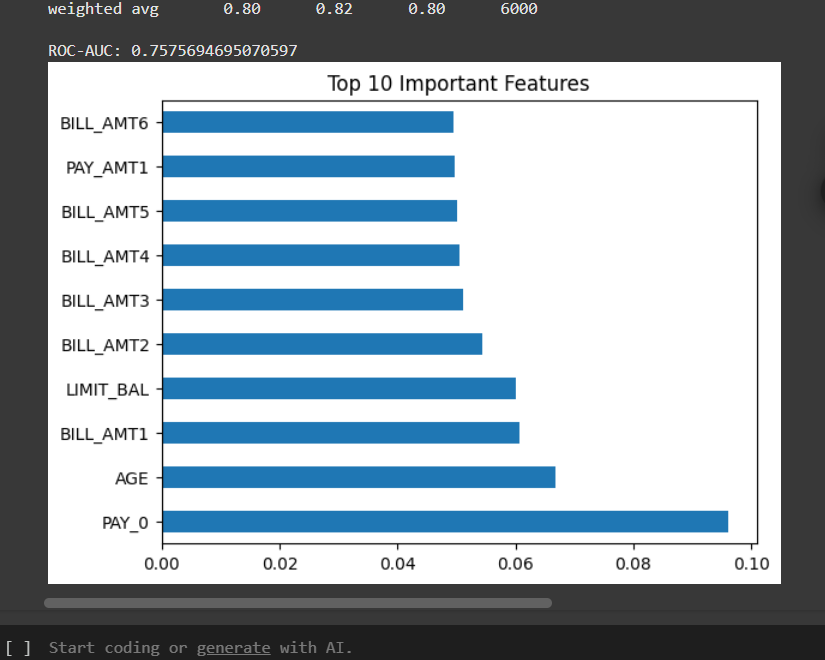

# 💳 Credit Scoring Model

This project is part of my **CodeAlpha Machine Learning Internship**, where I developed a machine learning model to predict an individual's likelihood of credit default using financial data.

---

## 📊 Project Highlights
- Predicts credit default risk based on financial and demographic features.
- Implemented **Logistic Regression** and **Random Forest Classifier**.
- Evaluated models with **Precision, Recall, F1-Score, ROC-AUC**.
- Visualized most influential features for model interpretability.

---

## 🗂 Dataset
- **Source:** UCI Credit Card Default Dataset (`UCI_Credit_Card.csv`)  
- Contains client demographic data, credit history, bill statements, and payment history.  
- **Target Variable:** `default` (1 = Default, 0 = No Default)

---

## 🧠 Methodology
1. **Data Preparation**
   - Dropped unnecessary `ID` column.
   - Renamed target column from `default.payment.next.month` to `default`.
   - Split data into training (80%) and testing (20%).

2. **Model Training**
   - Logistic Regression (baseline model).
   - Random Forest Classifier (ensemble method).

3. **Evaluation Metrics**
   - Confusion Matrix
   - Classification Report (Precision, Recall, F1-score)
   - ROC-AUC Score

4. **Feature Importance**
   - Identified top predictors influencing credit default.

---

## 🛠 Tools & Libraries
- Python
- Pandas, NumPy
- Scikit-learn
- Matplotlib, Seaborn

---

## 📈 Results
- **Best ROC-AUC Score:** ~0.75 (Random Forest)
- **Top Predictors:** PAY_0, AGE, BILL_AMT1–6, LIMIT_BAL

---

## 📷 Visual Outputs
### Top 10 Important Features

---

## 💼 Internship Details:
This project was completed as part of the Machine Learning Internship at CodeAlpha.
